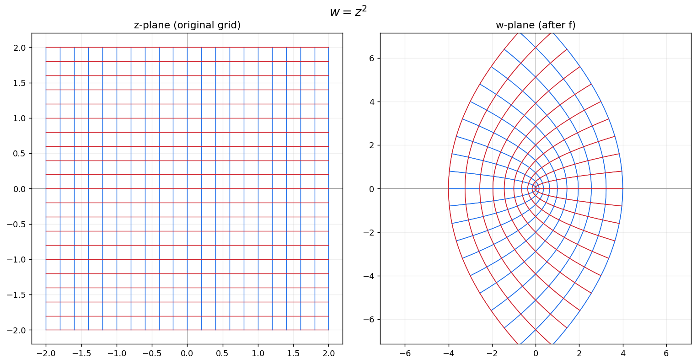
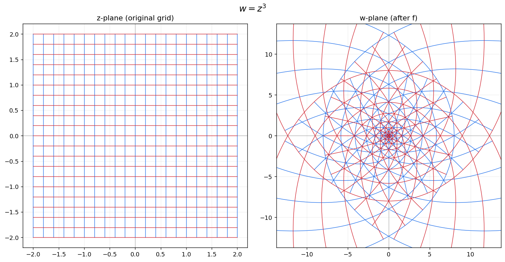
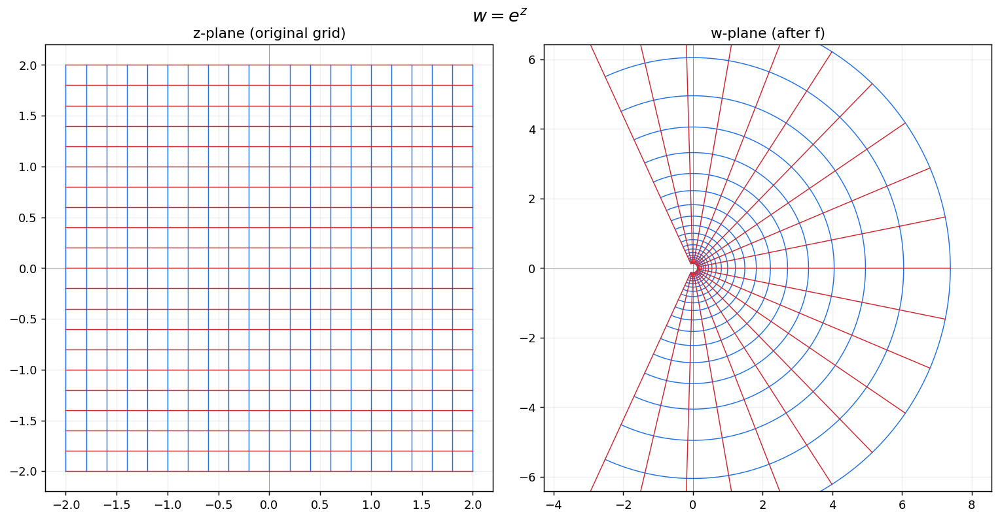
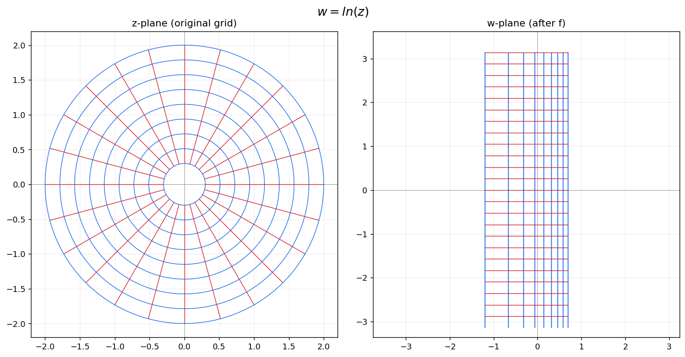
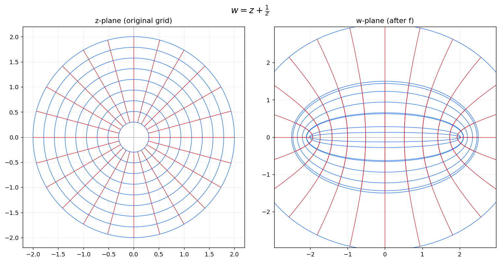
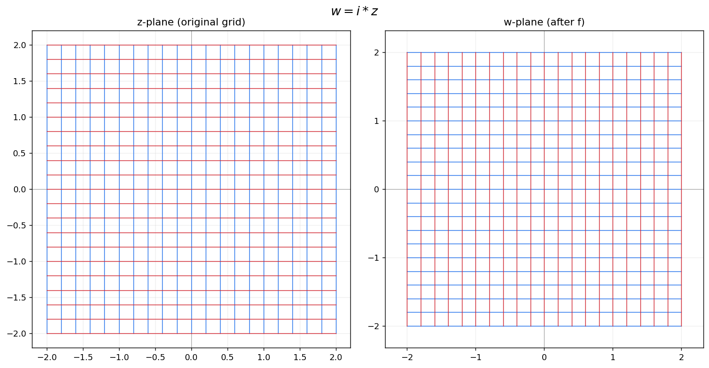
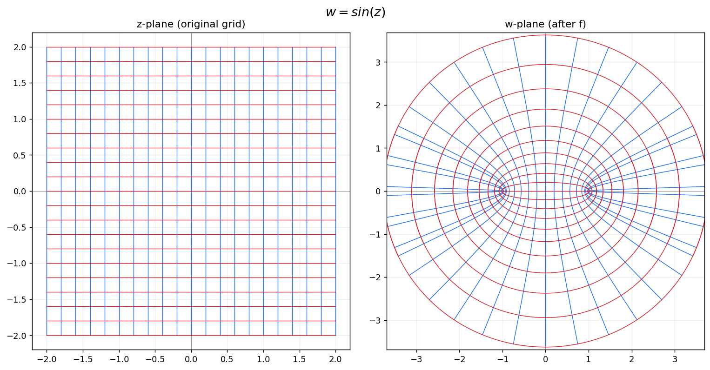

# 解析函数的共形变换可视化（Conformal-Mapping-Visualization）

用 Python 可视化复变函数中的**共形变换**or**保角变换**

> 课程：数据结构与算法B ｜ 作者：陈志胤｜ 专业：物理学院

## 一、项目背景

这学期我在学《数学物理方法》的复变函数部分.这部分有一个很漂亮的结论： 解析函数在导数非零处是**共形映射**——它会把相交的曲线变换成另外两条曲线，且**保持交角不变**. 由于只在脑海中想象会比较抽象，故我想将它可视化： 让网格、圆或是一张真实照片经过 `z²`、`eᶻ`等函数后变形，直观感受"解析函数如何重新塑造平面".

## 二、主要功能

本项目包含两个可在**命令行**直接运行的**交互式工具**：

1. **网格变换可视化**（`source/conformal_grid.py`）
   输入函数 LaTeX + 选择初始网格（直角 / 极坐标），输出"左=原始网格、右=变换结果"的对比图.

2. **照片共形变换**（`source/conformal_image.py`）
   输入函数 LaTeX + 一张照片路径，输出按该函数变形后的照片.

## 三、核心逻辑

**网格可视化的逻辑**：

网格线就是一族参数曲线 $z(t)$。它的像直接代进去算：

$$
w(t) = f\big(z(t)\big)
$$

逐点计算、连成曲线即可.横线与竖线本来垂直相交，变换后由保角性**仍然垂直相交**——图上肉眼可验证.极坐标网格同理，只是把曲线换成同心圆 $r e^{i\theta}$ 和放射线，用来绕开 $1/z$ 这类在原点的奇点.

**照片变换的逻辑**：

把输出图记作 $\text{out}$、原图记作 $\text{src}$，这要求

$$
\text{out}\big(f(z_0)\big) = \text{src}(z_0)
$$

令 $w = f(z_0)$，即 $z_0 = f^{-1}(w)$，代回得到实际要用的公式：

$$
\text{out}(w) = \text{src}\big(f^{-1}(w)\big)
$$

含义是：**遍历输出图的每个像素 $w$，去原图的 $f^{-1}(w)$ 处取颜色**，即「逆向采样」.

## 四、知识点与算法

| 知识点           | 在项目中的体现                                              |
| ---------------- | ----------------------------------------------------------- |
| 复数的表示与运算 | 全程用 numpy 复数数组直接计算 `f(z)`                        |
| 共形映射         | 变换前后网格交点处仍互相垂直，直观验证保角性                |
| 函数的奇点       | `1/z` 等在原点的奇点：极坐标网格绕开、自动取景忽略极端值    |
| 多值函数与支割线 | `z^2`、`sin z` 的逆有多支，程序选主支，结果中可见支割线接缝 |
| 逆映射           | 照片变换需对 `f` 求逆，对每个输出点反查原图坐标             |

工程上的三个自主实现亮点：

- **自写轻量 LaTeX 解析器**：不依赖任何外部 LaTeX 解析库，手动处理 `^`、`\frac`、
  `\sqrt`、`e^{}`、三角/指数/对数、隐式乘法（`2z`）与虚数单位 `i`，再交给 sympy 计算.
  好处是项目依赖极少、下载即用.
- **符号求逆 + 全分辨率直接采样**：照片变换用 sympy 求出 `f` 的闭式逆函数，再直接在
  原图上双线性采样，保证清晰锐利、不发糊.
- **分位数自动取景**：用变换后坐标的 2%/98% 分位数自动框定显示范围，自动忽略奇点附近跑向无穷的极端值，无需手动调参.

## 五、零基础运行指南

两个脚本均可在命令行（Windows 的 cmd / PowerShell，macOS 的终端）直接运行，**无需任何编辑器或 IDE**.

### 步骤0：下载本项目代码

在本仓库页面点绿色的 **Code** 按钮 → **Download ZIP**，下载后**解压**，你会得到一个文件夹（里面有 `source`、`document`、`README.md` 等）.我们主要关注`source`文件夹的位置，例如将其放在桌面.

### 步骤1：打开终端并检查

对于Windows：快捷键 Win + R，输入 cmd 回车打开命令终端
对于macOS：快捷键 Command + 空格，搜索「终端」打开命令窗口

在命令行里输入下面这行，回车：

```bash
python --version
```

- 如果显示出一个版本号（如 `Python 3.12.0`），说明已装好，继续下一步.
- 如果报错，说明还没装 Python：去 https://www.python.org/downloads/ 下载安装，**安装时务必勾选最下面的 "Add Python to PATH"**，装完重开命令行再试.
- （对于 macOS / Linux ，请把本文所有 `python` 换成 `python3`.）

### 步骤 3：安装依赖库（仅首次需要）

在命令行里输入下面这行，回车后等待下载完成：

```bash
pip install numpy matplotlib scipy pillow sympy
```

> 若提示找不到 pip，改用：`python -m pip install numpy matplotlib scipy pillow sympy`

### 步骤4：让命令行进入代码所在的文件夹

命令行默认是在用户个人文件夹而不是在代码文件夹，需进行以下操作：

1.输入 `cd`，再按一下空格

2.把步骤 0 解压出的`source`文件夹，用鼠标直接拖进命令行窗口——它的完整路径会自动填上

3.回车

### 步骤 5：运行

**① 网格变换**

输入下面这行：

```bash
python conformal_grid.py
```

回车后按提示输入公式和网格类型：

```
f(z) = (填写公式)
初始网格  [1] 直角坐标   [2] 极坐标 ：(填写1或2)
```

稍等片刻，生成的图片会自动保存到脚本所在文件夹（即 `source` 文件夹里）.

**② 照片变换**

输入下面这行：

```bash
python conformal_image.py
```

回车后按提示输入公式和图片路径：

```
f(z) = (填写公式)
图片路径：(填写路径)
```

图片路径不必手打——可以**直接把图片文件拖进命令行窗口**，路径会自动填好.
变换后的图片同样保存到脚本所在文件夹.


### 附：支持的 LaTeX 语法

| 写法             | 含义               | 示例            |
| ---------------- | ------------------ | --------------- |
| `z`              | 自变量（必须用 z） | `z^2`           |
| `^`              | 幂                 | `z^3`、`z^{10}` |
| `\frac{A}{B}`    | 分式               | `\frac{1}{z}`   |
| `\sqrt{A}`       | 平方根             | `\sqrt{z}`      |
| `e^{A}`          | 指数               | `e^{z}`         |
| `\ln`, `\log`    | 对数               | `\ln(z)`        |
| `\sin \cos \tan` | 三角函数           | `\sin(z)`       |
| `i`              | 虚数单位           | `\frac{1}{z-i}` |

## 六、效果展示

### 1：网格变形可视化

<div align="center">

<br>
图1：幂函数 w=z^2 共形网格变换对比
</div>

<br>

<div align="center">

<br>
图2：幂函数 w=z^3 共形网格变换对比
</div>

<br>

<div align="center">

<br>
图3：指数函数 w=e^z 共形网格变换对比
</div>

<br>

<div align="center">

<br>
图4：对数函数 w=ln(z) 共形网格变换对比
</div>

<br>

<div align="center">

<br>
图5：儒可夫斯基变换 w=z+1/z 共形网格变换对比
</div>

<br>

<div align="center">

<br>
图6：虚数旋转变换 w=iz 共形网格变换对比
</div>

<br>

<div align="center">

<br>
图7：正弦函数 w=sin(z) 共形网格变换对比
</div>

### 2：图像变形

这里以图书馆的照片为例

<div align="center">

<br>
图8：图书馆
</div>

<br>

<div align="center">

<br>
图9：指数变换
</div>

<br>

<div align="center">

<br>
图10：反比例变换
</div>

<br>

<div align="center">

<br>
图11：对数变换
</div>


## 七、AI 工具声明

复变函数的数学原理、映射的几何解释、各功能的设计思路由本人理解并主导；
利用 AI 辅助编写了 matplotlib 绘图、图像采样、LaTeX 解析等部分的代码，
并由本人逐行阅读、调试与修改（例如：把会不稳定的方格网改为极坐标网格、
将不稳定的数值反查改为符号求逆 + 直接采样、加入分位数自动取景等）.

## 八、开源协议

本项目采用 MIT License.
